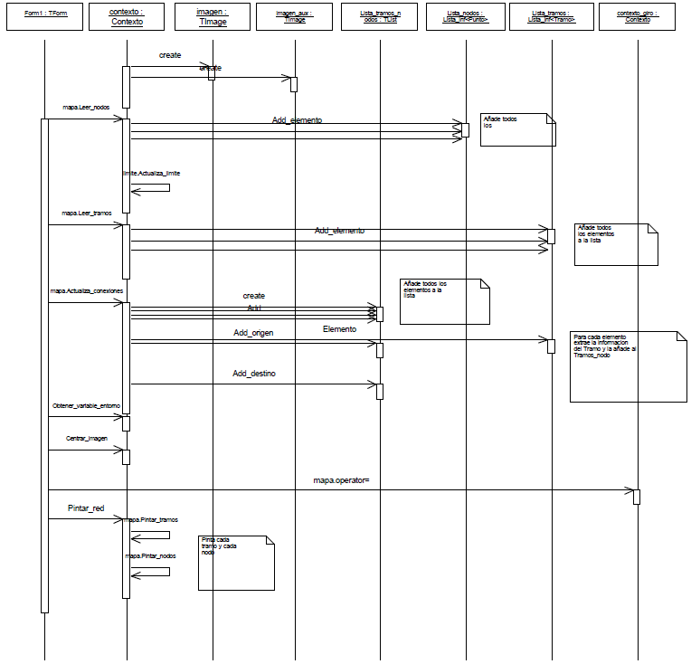

# Diagramas de Secuencia

## Introducción

Los diagramas de interacción representan las interacciones entre objetos, mostrando sus relaciones y los mensajes intercambiados entre ellos. Estos diagramas cubren la vista dinámica del sistema, donde la clase a la que pertenece cada objeto se indica después del nombre del objeto, separada por dos puntos.

## Tipos de Diagramas de Interacción

Los diagramas de secuencia y de colaboración son dos tipos específicos de diagramas de interacción:

- **Diagramas de secuencia**: Enfatizan el orden temporal de los mensajes
- **Diagramas de colaboración**: Destacan la organización estructural de los objetos emisores y receptores

## Aplicación en Casos de Uso

Los diagramas de secuencia se utilizan principalmente para especificar:
- El flujo principal de un caso de uso
- Las variaciones para representar flujos excepcionales del caso de uso

## Estructura de los Diagramas

### Diagrama de Secuencia
- **Eje X**: Objetos (instancias de clases) dispuestos horizontalmente
- **Eje Y**: Mensajes ordenados temporalmente
- **Línea de vida**: Línea discontinua vertical que representa la existencia de un objeto durante un período de tiempo

### Diagrama de Colaboración
Estructurado como una colección de nodos y arcos que conectan los objetos participantes.

## Ejemplos Prácticos

Los siguientes ejemplos ilustran cómo los diagramas de secuencia definen la implementación de casos de uso específicos.

### Caso Especial: Crear Interfaz Gráfico

Existe un diagrama de secuencia que no define la implementación de un caso de uso específico, sino una secuencia común que debe seguirse en todos los casos de uso denominados "Crear interfaz gráfico". Este patrón aparece en las interfaces de nodos, tramos y líneas de bus, definiendo la secuencia necesaria para crear las dos imágenes que se muestran en la parte derecha de cada interfaz. 

### Ejemplo 1: Cargar Datos de Red Vial para Representación Gráfica

El primer diagrama de secuencia (figura 3.2.3.1) implementa el caso de uso "Cargar datos de la red vial para representación gráfica", presente en el diagrama de casos de uso del interfaz para representación gráfica.

#### Análisis de Participantes
El diagrama permite identificar claramente qué objetos (no clases) intervienen en el caso de uso.

#### Flujo de Ejecución
Siguiendo el orden temporal del diagrama (eje Y), se ejecutan los siguientes métodos:

**1. Inicialización de Objetos**
El objeto `contexto` (clase Contexto) crea los objetos `imagen` e `imagen_aux`, enviando mensajes de creación a cada uno.

**2. Lectura de Nodos**
El formulario `Form1` invoca el método `Leer_nodos` de la propiedad `mapa` del objeto `contexto`. Este proceso:
- Lee los nodos desde disco
- Obtiene datos del archivo
- Agrega cada nodo mediante el método `Add_elemento` del objeto `Lista_nodos` (lista de objetos clase Punto)

*Figura 3.2.3.1: Diagrama de secuencia de Cargar red vial para representación gráfica*

**3. Cálculo de Límites**
Una vez cargados todos los nodos, `Form1` invoca `mapa.Actualiza_limite` del objeto `contexto` para calcular las coordenadas del rectángulo que contendrá todos los nodos.

**4. Lectura de Tramos**
El objeto `Form1` ejecuta `mapa.Leer_tramos` del objeto `contexto`, siguiendo un proceso similar al de los nodos:
- Lectura de cada tramo
- Agregación a `Lista_tramos` (lista de objetos clase Tramo) mediante `Add_elemento`

**5. Actualización de Conexiones**
`Form1` invoca `mapa.Actualiza_conexiones` del objeto `contexto` para establecer las relaciones entre elementos.

**6. Creación de Lista de Tramos por Nodo**
Se genera `Lista_tramos_nodo`. Para cada elemento en `Lista_tramos`:
- Se identifica el nodo origen y destino
- Se agrega información a `Lista_tramos_nodo` usando `Add_origen` y `Add_destino`

**7. Configuración de Visualización**
- `Form1` ejecuta `Obtener_variable_entorno` para calcular variables del entorno
- Invoca `Centrar_imagen` para calcular el desplazamiento necesario y centrar la red vial
- Copia valores de la propiedad `mapa` del objeto `contexto` a la propiedad `mapa` del objeto `contexto_giro`

**8. Renderizado Final**
`Form1` ejecuta `Pintar_red` del objeto `contexto`, que invoca:
- `mapa.Pintar_tramos`
- `mapa.Pintar_nodos`

### Ejemplo 2: Realizar Zoom y Windowing

El segundo caso de uso completamente implementado es "Realizar zoom y windowing", que aparece en el mismo diagrama de casos de uso anterior.

El diagrama de secuencia correspondiente se muestra en la figura 3.2.3.2. Es importante destacar que este diagrama es válido tanto para zoom como para windowing, únicamente cambiando la llamada al método `Realizar_zoom` por `Realizar_windowing`.

#### Configuración Inicial
El objeto `boton_zoom` ejecuta tres métodos para asignar manejadores de eventos:
- `Caja_zoom_inicio` → evento `onMouseDown`
- `Caja_zoom_desplazamiento` → evento `onMouseMove`  
- `Caja_zoom_final` → evento `onMouseUp`

Todos estos eventos se asocian a la propiedad `imagen` del objeto `contexto`.

#### Flujo de Eventos

**1. Inicio de Selección (onMouseDown)**
Cuando se produce el evento `onMouseDown` sobre la imagen:
- El objeto `contexto` invoca `Activar_caja` del objeto `zoom` (activa la funcionalidad)
- Ejecuta `Actualizar_caja` del objeto `zoom` (almacena las dimensiones iniciales del rectángulo de selección)

**2. Selección Dinámica (onMouseMove)**
Los eventos consecutivos `onMouseMove` desencadenan una secuencia que permite visualizar el rectángulo de selección en tiempo real mientras el usuario arrastra el mouse.

**3. Finalización (onMouseUp)**
Al completar la selección:
- Se ejecuta `Pinta_rectangulo_min` para obtener las dimensiones finales del rectángulo seleccionado
- Se invoca `Desactivar_caja` para finalizar el proceso de selección

Este patrón de interacción proporciona una experiencia de usuario fluida para operaciones de zoom y windowing, permitiendo selecciones visuales intuitivas mediante arrastre del mouse.

## Conclusión

Los diagramas de secuencia constituyen una herramienta fundamental para documentar y especificar el comportamiento dinámico de los sistemas. A través de los ejemplos presentados, se demuestra cómo estos diagramas:

- **Clarifican la implementación**: Definen de manera precisa los pasos necesarios para implementar casos de uso
- **Facilitan la comunicación**: Proporcionan un lenguaje visual común para desarrolladores y analistas
- **Documentan interacciones**: Capturan las relaciones temporales entre objetos y sus responsabilidades
- **Guían el desarrollo**: Sirven como especificación detallada para la implementación de código

La representación visual del flujo temporal de mensajes entre objetos hace que los diagramas de secuencia sean especialmente valiosos para comprender sistemas complejos y asegurar que todas las interacciones necesarias estén correctamente especificadas.