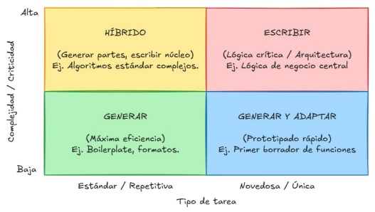

# Cuadrante de Decisión: Escribir vs Generar Código

Framework estratégico para decidir cuándo escribir código manualmente y cuándo utilizar IA para generarlo

## ¿Cuándo Aplicar?

- **Desarrollo con asistencia de IA** donde necesitas optimizar tiempo y calidad
- **Equipos mixtos** con diferentes niveles de experiencia en IA
- **Proyectos con presión de tiempo** que requieren decisiones rápidas sobre metodología
- **Arquitectura de software** donde la criticidad varía entre componentes
- **Code reviews** para evaluar si el código generado es apropiado

## ✅ Implementación

### 🧭 Marco de Decisión Estratégica

El cuadrante se basa en **dos ejes principales**:

- **Eje vertical**: Complejidad / Criticidad de la tarea
- **Eje horizontal**: Tipo de tarea (Estándar/Repetitiva vs Novedosa/Única)

### 🔴 Zona de Alto Valor Humano — **ESCRIBIR**

**Ubicación**: Alta complejidad + Alta novedad

**Razonamiento**:
- Requiere **juicio, contexto y creatividad** humana
- **Decisiones de arquitectura** que la IA no puede evaluar completamente
- **Control total** sobre el diseño y la implementación
- **Conocimiento del dominio** específico del proyecto

### 🟡 Zona Híbrida — **GENERAR PARTES + ESCRIBIR NÚCLEO**

**Ubicación**: Alta complejidad + Tareas estándar

**Razonamiento**:
- **Estructuras conocidas** → IA genera scaffolding
- **Lógica específica** → Humano mantiene control
- **Eficiencia sin sacrificar calidad** en áreas críticas

### 🟢 Zona de Alto Valor de IA — **GENERAR**

**Ubicación**: Baja complejidad + Tareas estándar

**Razonamiento**:
- **Máxima eficiencia** en tareas repetitivas
- **Patrones establecidos** que la IA maneja bien
- **Libera tiempo** para trabajo de mayor valor

### 🔵 Zona Generar y Adaptar — **PROTOTIPADO RÁPIDO**

**Ubicación**: Baja complejidad + Alta novedad

**Razonamiento**:
- **Acelera creación inicial** de conceptos nuevos
- **Iteración rápida** sobre ideas
- **Validación temprana** antes de invertir tiempo en escritura manual

## 🎯 Criterios de Decisión

### Factores que incrementan valor humano:
- **Conocimiento del dominio** específico requerido
- **Decisiones arquitecturales** con impacto a largo plazo
- **Lógica de negocio** con reglas complejas o excepciones
- **Componentes de seguridad** o manejo de datos sensibles
- **Performance crítica** donde cada optimización cuenta

### Factores que incrementan valor de IA:
- **Patrones establecidos** y bien documentados
- **Código repetitivo** con variaciones mínimas
- **Estructuras estándar** del framework/lenguaje
- **Documentación y tests** básicos
- **Configuraciones** y archivos de setup

## 🚨 Señales de Alerta

### ❌ No uses IA para:
- Lógica de autenticación y autorización crítica
- Algoritmos de encriptación o manejo de secretos
- Lógica de negocio con regulaciones específicas (GDPR, PCI-DSS)
- Código que maneja transacciones financieras
- Arquitectura de microservicios y comunicación entre servicios

### ⚠️ Revisa cuidadosamente IA en:
- Manejo de errores en flujos críticos
- Validaciones de entrada de usuario
- Queries de base de datos complejas
- Integrations con APIs de terceros
